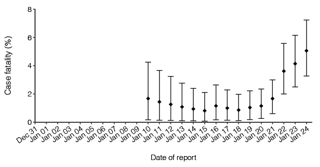

# Real-time assessment of the risk of death from novel coronavirus (COVID-19) infection

*Supporting materials* for Sung-mok Jung, Andrei R. Akhmetzhanov, Katsuma Hayashi, Natalie M. Linton, Yichi Yang, Baoyin Yuan, Tetsuro Kobayashi, Ryo Kinoshita, Hiroshi Nishiura Real-Time Estimation of the Risk of Death from Novel Coronavirus (COVID-19) Infection: Inference Using Exported Cases. J. Clin. Med. **2020**, 9, 523. ([doi:10.3390/jcm9020523](http://dx.doi.org/10.3390/jcm9020523)) 

[**See medrxiv version on github**](https://github.com/aakhmetz/WuhanCFR2020/blob/master/manuscript/Jung%20et%20al%202020%20Medrxiv%20-%20version%202.pdf)

**Abstract** The exported cases of 2019 novel coronavirus (2019-nCoV) infection who were confirmed in other countries provide a chance to estimate the cumulative incidence and confirmed case fatality risk (cCFR) in China. Knowledge of the cCFR is critical to characterize the severity and understand pandemic potential of 2019-nCoV in the early stage of epidemic. Using the exponential growth rate of the incidence, the present study statistically estimated the cCFR and the basic reproduction number, i.e., the average number of secondary cases generated by a single primary case in a naive population. As of 24 January 2020, with 23 exported cases, and estimating the growth rate from 8 December 2019 (scenario 1) and using the data since growth of exported cases (scenario 2), the cumulative incidence in China was estimated at 5433 cases (95% confidence interval (CI): 3883, 7160) and 17780 cases (95% CI: 9646, 28724), respectively. The latest estimates of the cCFR were 4.6% (95% CI: 3.1-6.6) for scenario 1 and 7.7% (95% CI: 4.9-11.3%) for scenario 2, respectively. The basic reproduction number was estimated to be 2.2 (95% CI: 2.1, 2.3) and 3.7 (95% CI: 3.1, 4.3) for scenarios 1 and 2, respectively. Based on the results, we note that current 2019-nCoV epidemic has a substation potential to cause a pandemic. The proposed approach can provide insights into early risk assessment using only publicly available data.

**Pre-processing the data** (R version 3.6.1)
* [A. Preparing the data - notebook version of the Rscript.ipynb](https://nbviewer.jupyter.org/github/aakhmetz/WuhanCFR2020/blob/master/scripts/A.%20Preparing%20the%20data%20-%20notebook%20version%20of%20the%20Rscript.ipynb)
 
**Main analysis** ([PyMC3](https://docs.pymc.io/) version 3.8 in Python)
* [C1a. Analysis in PyMC3 - Scenario 1.ipynb](https://nbviewer.jupyter.org/github/aakhmetz/WuhanCFR2020/blob/master/scripts/C1a.%20Analysis%20in%20PyMC3%20-%20Scenario%201.ipynb)
* [C1b. Analysis in PyMC3 - Scenario 2.ipynb](https://nbviewer.jupyter.org/github/aakhmetz/WuhanCFR2020/blob/master/scripts/C1b.%20Analysis%20in%20PyMC3%20-%20Scenario%202.ipynb)

**Sensitivity analysis** ([PyMC3](https://docs.pymc.io/) version 3.8 in Python)
* [D1. Sensitivity for t0.ipynb](https://nbviewer.jupyter.org/github/aakhmetz/WuhanCFR2020/blob/master/scripts/D1.%20Sensitivity%20for%20t0.ipynb)
* [D2a. Sensitivity for CUTOFF_TIME - Scenario 1.ipynb](https://nbviewer.jupyter.org/github/aakhmetz/WuhanCFR2020/blob/master/scripts/D2a.%20Sensitivity%20for%20CUTOFF_TIME%20-%20Scenario%201.ipynb)
* [D3a. Sensitivity for WuhanPop - Scenario 1.ipynb](https://nbviewer.jupyter.org/github/aakhmetz/WuhanCFR2020/blob/master/scripts/D3a.%20Sensitivity%20for%20WuhanPop%20-%20Scenario%201.ipynb)
* [D3b. Sensitivity for WuhanPop - Scenario 2.ipynb](https://nbviewer.jupyter.org/github/aakhmetz/WuhanCFR2020/blob/master/scripts/D3b.%20Sensitivity%20for%20WuhanPop%20-%20Scenario%202.ipynb)
* [D4a. Sensitivity for Tdetection - Scenario 1.ipynb](https://nbviewer.jupyter.org/github/aakhmetz/WuhanCFR2020/blob/master/scripts/D4a.%20Sensitivity%20for%20Tdetection%20-%20Scenario%201.ipynb)
* [D4b. Sensitivity for Tdetection - Scenario 2.ipynb](https://nbviewer.jupyter.org/github/aakhmetz/WuhanCFR2020/blob/master/scripts/D4b.%20Sensitivity%20for%20Tdetection%20-%20Scenario%202.ipynb)

**Generating the figures** (R version 3.6.1 with use of ggplot2 package)
* [E1. Figure 1.ipynb](https://nbviewer.jupyter.org/github/aakhmetz/WuhanCFR2020/blob/master/scripts/E1.%20Figure%201.ipynb)
* [E2. Figure - sensitivity for t0.ipynb](https://nbviewer.jupyter.org/github/aakhmetz/WuhanCFR2020/blob/master/scripts/E2.%20Figure%20-%20sensitivity%20for%20t0.ipynb)
* [E3a. Figure - sensitivity for CUTOFF_TIME - Scenario 1.ipynb](https://nbviewer.jupyter.org/github/aakhmetz/WuhanCFR2020/blob/master/scripts/E3a.%20Figure%20-%20sensitivity%20for%20CUTOFF_TIME%20-%20Scenario%201.ipynb)
* [E3b. Figure - sensitivity for CUTOFF_TIME - Scenario 2.ipynb](https://github.com/aakhmetz/WuhanCFR2020/blob/master/scripts/E3b.%20Figure%20-%20sensitivity%20for%20CUTOFF_TIME%20-%20Scenario%202.ipynb)

*References to other analysis on github*
* [Estimating case fatality ratio of COVID-19 from observed cases outside China by *Christian L. Althaus*](https://github.com/calthaus/ncov-cfr)

------
**Thank you for your interest to our work.**

Words of caution: We would like to note that our code is not supposed to work out of box, because our main intent was to show the relevance of the methods used in our paper.
